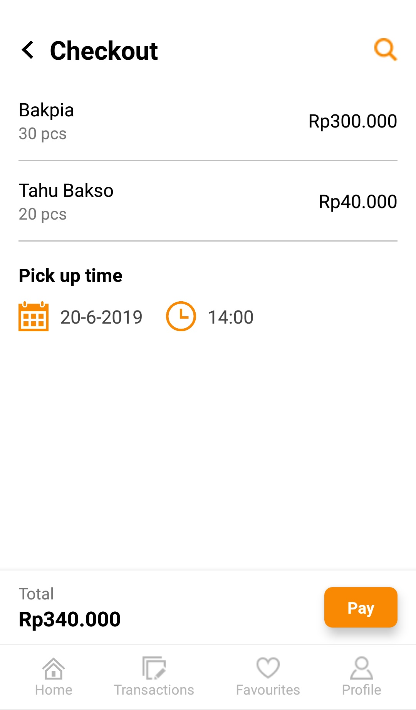

# GroFood
Food wholesaler application built with React Native

## Run the app

#### 1. Clone

```bash
# Clone the repo
git clone https://github.com/WildanZq/grofood.git
```

#### 2. Install

```bash
# Install dependencies
yarn install
```

or

```
npm install
```

#### 3. Run the _React Native_ App

```bash
# Start the React Native packager
yarn start
```

or

```bash
npm start
```

## Screenshots


---


---


---


---

